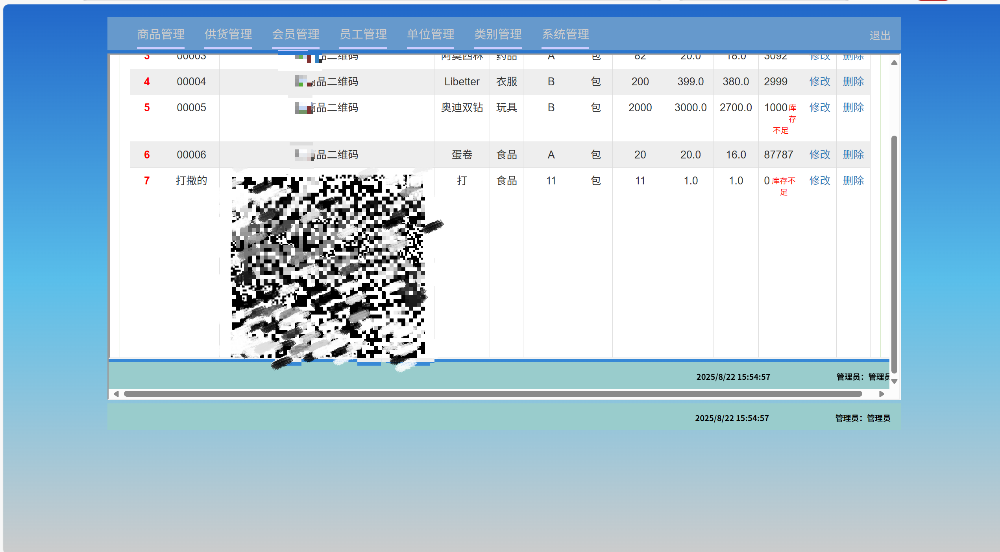
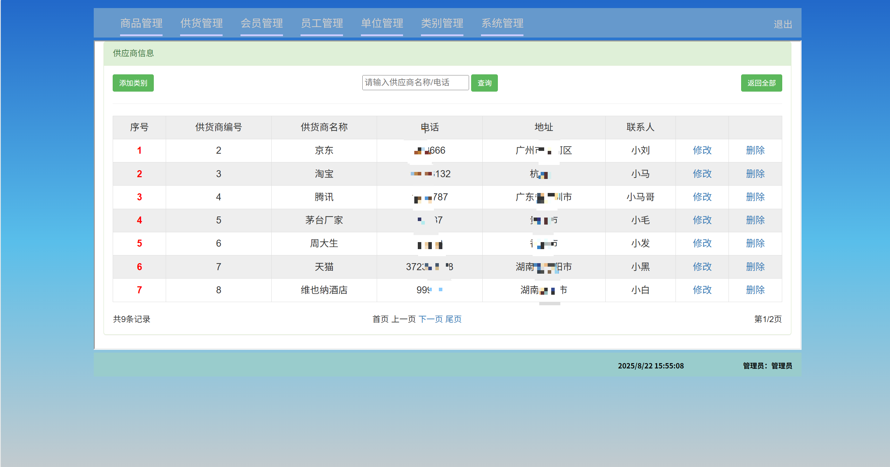
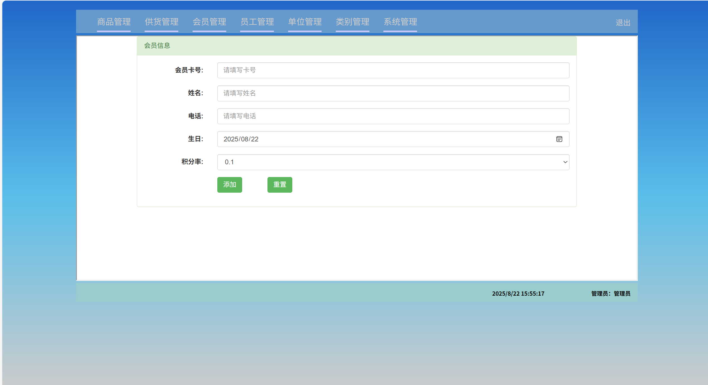
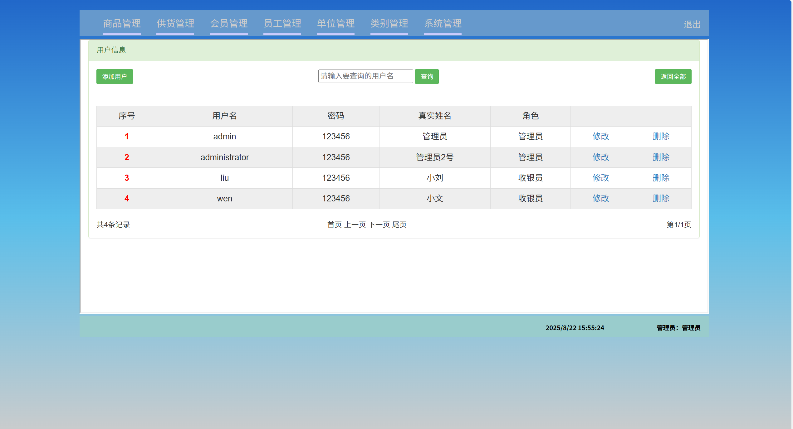
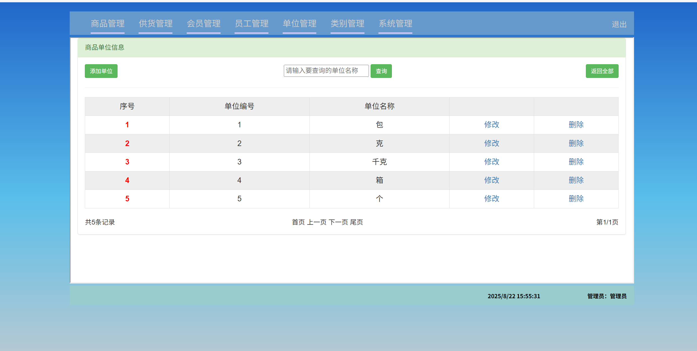
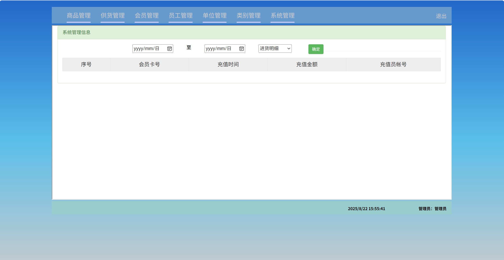
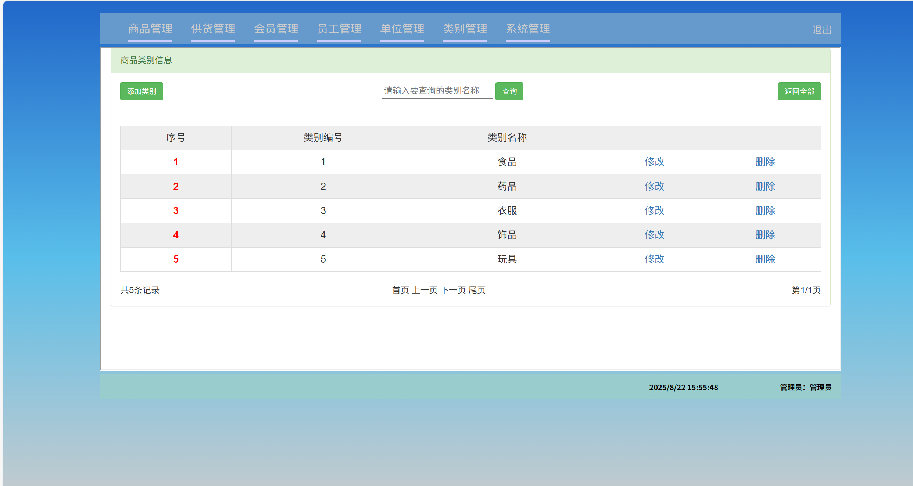

# jspServlet011
jspServlet011超市进销存管理系统
 
## 查看主页获取源码

### 一、关键词
超市进销存管理系统，超市管理系统

### 二、作品包含
源码+数据库+全套环境和工具资源+本地部署教程

### 三、项目技术
前端技术：Html、Css、Js、Jquery、Bootstrap
后端技术：Java、JSP、Servlet、JDBC

### 四、运行环境（以下版本亲测，其他版本兼容性请自行测试）
开发工具：IDEA/eclipse

数据库：MySQL5.7或8.0

服务器：Tomcat8.5或Tomcat9.0

数据库管理工具：Navicat10以上版本

环境配置软件： JDK1.8

浏览器：谷歌浏览器

### 五、项目介绍
项目编号：jspServlet011

超市进销存系统是专为超市日常运营打造的信息化管理工具，核心围绕 “采购（进）、销售（销）、库存（存）” 三大核心环节，整合数据管理、流程管控与决策支持功能，旨在解决传统人工管理效率低、数据滞后、库存混乱等问题，助力超市实现精细化运营与成本优化。

系统主要分为七大大模块：商品管理，供货管理、会员管理、单位管理、类别管理、系统管理。该界面是超市进销存系统的商品管理模块，可实现商品信息的添加、进货、查询（按条码 / 名称 / 类别），以及商品信息的修改、删除，还关联商品库存预警等管理 。

### 六、运行截图

